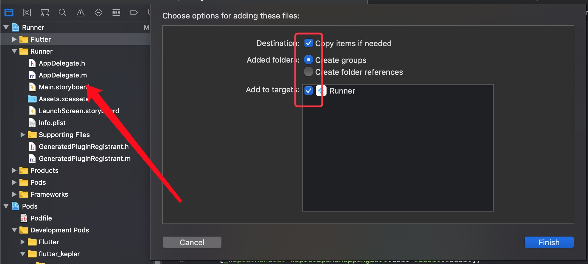

<!--
 * @Description: ReadMe
 * @Author: wuxing
 * @Date: 2019-09-07 17:52:18
 * @LastEditors: wuxing
 * @LastEditTime: 2019-09-16 21:04:50
 -->
# flutter_kepler

#### 介绍
flutter  京东开普勒插件

地址：[flutter_kepler](https://pub.dev/packages/flutter_kepler)

支持Android和iOS，原生版本V2.2.4

Android：983598009@qq.com
iOS：329106954@qq.com
### 如何引入项目

[如何引入](https://pub.dev/packages/flutter_kepler#-installing-tab-)
```
dependencies:
  flutter_kepler: ^版本号
```

### 已知问题
* iOS
不知道是不是example的iOS包名导购模式还在申请的原因，登录收不到回调。建议集成方自己试一下

### 工程性方法
参考[开普勒文档](http://kepler.jd.com/console/docCenterCatalog/docContent?channelId=46)

#### ios需要的工程性配置

1.进入[后台管理](http://kepler.jd.com/console/app/app_list.action)，生成自己的SDK
2.将下载的SDk解压缩得到 JDKeplerSDK.framework、Kepler.bundle（JDKeplerSDK.framework用不上）
3.将Kepler.bundle拖入原生项目，如下图


#### android需要的工程性配置

在待引入工程的android目录下, AndroidManifest.xml文件内

`例如 flutter_kepler\example\android\app\src\main\AndroidManifest.xml`

添加以下配置

```
<manifast>
	...
	<uses-permission android:name="android.permission.INTERNET" />
    <uses-permission android:name="android.permission.ACCESS_WIFI_STATE" />
    <uses-permission android:name="android.permission.READ_PHONE_STATE" />
    <uses-permission android:name="android.permission.ACCESS_NETWORK_STATE" />
    <uses-permission  android:name="android.permission.READ_EXTERNAL_STORAGE" />
    <uses-permission android:name="android.permission.WRITE_EXTERNAL_STORAGE" />
    ...
    <application ...>
    ...
    <activity android:name="com.kepler.jd.login.AuthSuccessActivity" 
    android:exported="true" 
    android:screenOrientation="portrait" > 
</activity> 


<activity
        android:name="com.kepler.jd.sdk.KeplerMidActivity"
    android:screenOrientation="portrait"          
    android:theme="@android:style/Theme.Translucent.NoTitleBar.Fullscreen"       
    android:windowSoftInputMode="adjustPan|stateHidden"></activity>

<activity android:name="com.kepler.jd.sdk.WebViewActivity" 
        android:screenOrientation="portrait" />
    ...
    </application>
</manifast>
```

[参考链接](<http://kepler.jd.com/console/docCenterCatalog/docContent?channelId=45>)

安全图片同样需要放在 待引入工程的android目录下 ,  /main/res/raw/safe.jpg


### 方法说明
* 头文件引入
```
import 'package:flutter_kepler/flutter_kepler.dart';
```

* 初始化
```
 /**
   * 初始化
   * appKey:去管理后台查看
   * appSecret:去管理后台查看
   * result:{
   * errorCode,     //0为初始化成功，其他为失败
   * errorMessage,  //message
   * }
   */
var result = await FlutterKepler.initKepler(
                appKey: "",
                appSecret: "",
              );
```

* 打开url
```
///
  ///  通过URL打开任意商品页面
  ///  @param url              页面url
  ///  @param userInfo    不需要可以不传   传参数据为第三方应用自定义,可以为页面,频道标识;也可以标识分成信息;该数据只做统计需求。传参长度，使用URL encode之后长度必须小于256字节（不建议传入中文以及特殊字符）
  /// 禁止传参带入以下符号：   =#%&+?<{}
  ///
  ///
  FlutterKepler.keplerPageWithURL(
              url: "",
              userInfo:{},
            );
```

* 打开导航页
```
  ///
  ///  打开导航页
  ///  @param userInfo    不需要可以不传   传参数据为第三方应用自定义,可以为页面,频道标识;也可以标识分成信息;该数据只做统计需求。传参长度，使用URL encode之后长度必须小于256字节（不建议传入中文以及特殊字符）
  /// 禁止传参带入以下符号：   =#%&+?<{}
  ///
  ///
FlutterKepler.keplerNavigationPage(userInfo:{},);
```

* 通过SKU打开Kepler单品页
```

  ///
  ///  通过SKU打开Kepler单品页
  ///  @param sku              商品sku
  ///  @param userInfo    不需要可以不传  传参数据为第三方应用自定义,可以为页面,频道标识;也可以标识分成信息;该数据只做统计需求。传参长度，使用URL encode之后长度必须小于256字节（不建议传入中文以及特殊字符）
  /// 禁止传参带入以下符号：   =#%&+?<{}
  ///
  ///
 FlutterKepler.keplerOpenItemDetailWithSKU(
              sku: "",
              userInfo:{},
            );
```

* 打开订单列表
```
  ///
  ///  打开订单列表
  ///  @param userInfo    不需要可以不传  传参数据为第三方应用自定义,可以为页面,频道标识;也可以标识分成信息;该数据只做统计需求。传参长度，使用URL encode之后长度必须小于256字节（不建议传入中文以及特殊字符）
  /// 禁止传参带入以下符号：   =#%&+?<{}
  ///
  ///
   FlutterKepler.keplerOpenOrderList(
       userInfo:{}
   );
```


* 根据搜索关键字打开搜索结果页
```
  ///
  ///  根据搜索关键字打开搜索结果页
  ///  @param searchKey     搜索关键字
  ///  @param userInfo    不需要可以不传  传参数据为第三方应用自定义,可以为页面,频道标识;也可以标识分成信息;该数据只做统计需求。传参长度，使用URL encode之后长度必须小于256字节（不建议传入中文以及特殊字符）
  /// 禁止传参带入以下符号：   =#%&+?<{}
  ///
  ///
   FlutterKepler.keplerOpenSearchResult(
              searchKey: "",
              userInfo:{}
            );
```

* 打开购物车界面
```
  ///
  ///  打开购物车界面
  ///  @param userInfo    不需要可以不传  传参数据为第三方应用自定义,可以为页面,频道标识;也可以标识分成信息;该数据只做统计需求。传参长度，使用URL encode之后长度必须小于256字节（不建议传入中文以及特殊字符）
  /// 禁止传参带入以下符号：   =#%&+?<{}
  ///
  ///
 FlutterKepler.keplerOpenShoppingCart(
     userInfo:{}
 );
```


* 添加到购物车（深圳的加车接口）
```
  ///
  ///  添加到购物车（深圳的加车接口）
  /// @param sku 添加到购物车中的商品id
  /// @param number 添加到购物车中商品数量,默认1件
  ///result:{
  ///   errorCode,     //0为成功，其他为失败
  ///   errorMessage,  //message
  ///  }
  ///
   var result = await FlutterKepler.keplerAddToCartWithSku(
              sku: "",
              number:"",
            );
```

* 联盟一键加购
```
  ///
  ///联盟一键加购
  ///unionID 联盟ID
  ///AppID 查看位置：我的推广-推广管理-APP管理
  ///skuID 商品SKU,
  ///subUnionId 子联盟ID，可用于区分媒体自身的用户ID
  ///refer refer (原生页面传域名+文章编号)
  ///
  ///result:{
  ///   errorCode,     //0为成功，其他为失败
  ///   errorMessage,  //message
  ///  }

var result = await FlutterKepler.keplerFastPurchase(
              unionID: "",
              appID: "",
              skuID: "",
              refer: "",
            );
```
*   购物车一键加购
```
  ///
  ///购物车一键加购
  ///unionID 联盟ID
  ///AppID 查看位置：我的推广-推广管理-APP管理
  ///skus 商品SKU的数组[CatrItem],
  ///refer refer (原生页面传域名+文章编号)
  ///subUnionId 子联盟ID，可用于区分媒体自身的用户ID
  ///
  var result = await FlutterKepler.keplerFastPurchaseSkus(
              unionID: "",
              appID: "",
              refer: "",
              skus: [CatrItem("",""),CatrItem("","")],
              subUnionId: "",
            );
```
* 登录授权
```
 ///⚠️iOS可能收不到回调，Android正常，请自行测试
  ///登录授权
  ///
  ///result:{
  ///   errorCode,     //0为成功，其他为失败
  ///   errorMessage,  //message
  ///  }
  var result = await FlutterKepler.keplerLogin();
```

* 登出并清除登录状态
```
 ///登出，清除登录状态
  FlutterKepler.keplerCancelAuth();
```

* 判断是否登录
```
  ///判断登录是否失效
  ///
  ///result:{
  ///   errorCode,     //0为成功，其他为失败
  ///   errorMessage,  //message
  ///  }
 var result = await FlutterKepler.keplerIsLogin();
```

* 是否强制使用H5打开界面 默认为true
```
/// 是否强制使用H5打开界面 默认为true;
  /// 设置为false时,调用商品详情页,订单列表,购物车等方法时将跳转到京东app并打开对应的界面
    FlutterKepler.setKeplerOpenByH5(isOpenByH5: bool);
```
